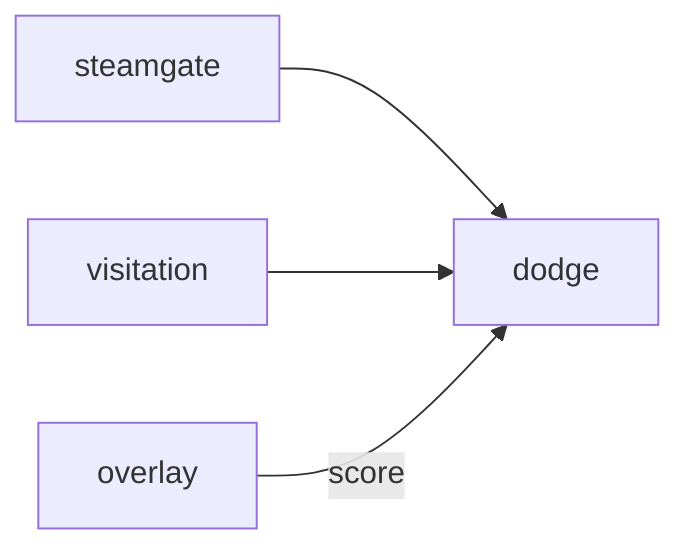

# Dodge

**A playful food fight for desktop pets.**

A planned team dodgeball game with harmless throws, sit emotes, and Steam lobbies.

**Stage: design scaffold.** This checkout contains a design document and a source placeholder. The experience below is planned; there is no runnable app or integrated service yet.

[Status](#status) · [Planned experience](#planned-experience) · [Contributor quickstart](#contributor-quickstart) · [Game design](docs/DESIGN.md) · [Ecosystem map](https://github.com/RicheyWorks/computerpets-ecosystem)

## Status

| Available today | What you can inspect |
| --- | --- |
| [Game design](docs/DESIGN.md) | Intended behavior, boundaries, and planned dependencies. |
| [Source placeholder](src/Game.cs) | Empty C# class; no Unity project or scene is checked in. |
| [MIT license](LICENSE) | Licensing terms for the repository. |

Gameplay, endpoints, integration arrows, and failure handling on this page describe implementation targets. No build/test harness, CI workflow, or product screenshots are included in this scaffold.

## Planned experience

- 4v4 arena. Throw food / toys, not weapons.
- Last team standing or score.
- OBS Overlay can show scores.
- Host overlay can spectate as a giant sticker.

### Planned technology

- Genre: **Party game**
- Engine: **Unity**
- Stack: Unity 6 · C# netcode · 4v4 throws · overlay sprites as bodies
- Default surface: `Unity editor`

### Planned connections

These arrows show intended dependencies, rather than working integrations.



## Contributor quickstart

With access to this private repository, Git and PowerShell are enough to review the scaffold:

```powershell
git clone https://github.com/RicheyWorks/computerpets-dodge.git
Set-Location computerpets-dodge
Get-Content docs/DESIGN.md
Get-Content src/Game.cs
```

Read [Game design](docs/DESIGN.md) before choosing implementation details. The commands above inspect the checked-in files; app installation, editor launch, and server startup become possible after a buildable project and entry point are added.

### First implementation target

**2v2 food-fight, host migrate, Overlay scoreboard.**

You know it works when: Host drop migrates. Grief mute. Ragdoll off by default.

Treat this as an acceptance target for a future implementation. Start with the documented slice, add the required project setup and focused tests, and update these instructions with commands that work from a fresh clone.

## Design boundaries

1. Minigames cannot mint or burn NFTs by themselves (Minter is the write path).
2. Stats come from lived overlay care + Dojo caps, not cash shop.
3. Species kits stay inside Lore. Illegal hybrids never spawn.
4. Fail soft: the desktop overlay process is not this process.

**Required failure behavior:**

Host migrate on drop. Grief throw at lobby → mute. Physics ragdoll off by default (reduce motion).

## Ecosystem

- [computerpets-visitation](https://github.com/RicheyWorks/computerpets-visitation)
- [computerpets-steamgate](https://github.com/RicheyWorks/computerpets-steamgate)
- [computerpets-twitch](https://github.com/RicheyWorks/computerpets-twitch) (bits = extra ball)
- [computerpets-overlay](https://github.com/RicheyWorks/computerpets-overlay)

Start with the [ComputerPets flagship](https://github.com/RicheyWorks/computerpets) for the desktop pet. This repository describes an optional extension; the [ecosystem map](https://github.com/RicheyWorks/computerpets-ecosystem) explains the broader plan.

## License

MIT. See [LICENSE](LICENSE).
