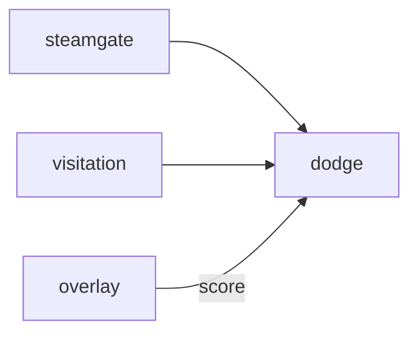

# Dodge

**Pet Dodgeball** — Multiplayer party dodgeball with desktop pets throwing harmless items.

Part of [ComputerPets](https://github.com/RicheyWorks/computerpets). Map: [computerpets-ecosystem](https://github.com/RicheyWorks/computerpets-ecosystem).

| | |
| --- | --- |
| Status | Design scaffold — loop and engine frozen |
| License | MIT |
| Tokens | Minigames never mint or burn. Tired overlay, not a dead lineage. |
| First pet | [Meet Rui first](https://github.com/RicheyWorks/computerpets/blob/main/docs/START-HERE.md). This game is optional. |

## The loop

Party night. No HP bars that threaten a lineage. Hit = sit emote. Visitation friends drop in. Steam lobby via Steamgate.

## Who plays

Party night. Steam lobby.

## What it is not

A lineage threat. Hit = sit emote. PvP weapons are toys.

## Genre and engine

- Genre: **Party game**
- Engine: **Unity**
- Stack: Unity 6 · C# netcode · 4v4 throws · overlay sprites as bodies
- Default surface: `Unity editor`

## Architecture



## How you play

1. 4v4 arena. Throw food / toys, not weapons.
2. Last team standing or score.
3. OBS Overlay can show scores.
4. Host overlay can spectate as a giant sticker.

## First slice

Build this and stop.

**2v2 food-fight, host migrate, Overlay scoreboard.**

You know it works when: Host drop migrates. Grief mute. Ragdoll off by default.

## Environment

Unity 6, Steamgate appid

## Failure doctrine

Host migrate on drop. Grief throw at lobby → mute. Physics ragdoll off by default (reduce motion).

Canon rules that never yield:

- 210 living kinds. No illegal hybrids.
- Overlay pets can get tired, sick, or hide. Tokens are not burned by a minigame.
- Desktop walk stays the main quest. Closing Dodge must leave Rui walking.

## Neighbors

- computerpets-visitation
- computerpets-steamgate
- computerpets-twitch (bits = extra ball)
- computerpets-overlay

## Layout

```
computerpets-dodge/
  README.md
  LICENSE
  docs/DESIGN.md
  src/                implementation lands here
```

## Run (Windows)

```powershell
Unity Hub > Dodge/; Netcode play mode. Steam appid via Steamgate.
```

Meet Rui first via the [flagship start-here](https://github.com/RicheyWorks/computerpets/blob/main/docs/START-HERE.md). This game is optional.

## Links

- Flagship: [RicheyWorks/computerpets](https://github.com/RicheyWorks/computerpets)
- This repo: [RicheyWorks/computerpets-dodge](https://github.com/RicheyWorks/computerpets-dodge)
- Map: [RicheyWorks/computerpets-ecosystem](https://github.com/RicheyWorks/computerpets-ecosystem)
- Design file: [docs/DESIGN.md](docs/DESIGN.md)

## License

MIT. See [LICENSE](LICENSE).

---

*Two hundred ten living kinds. Keep them so a line does not go quiet.*
